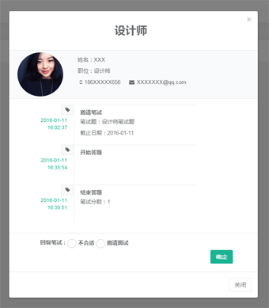
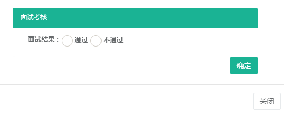
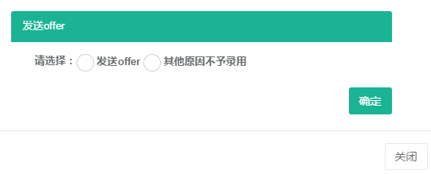
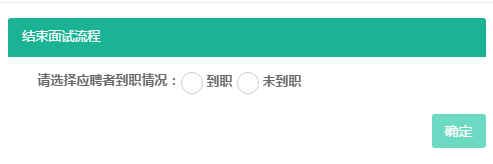

## 工作台页面功能

工作台页面是系统的主要操作页面，包括了新建应聘者到结束应聘者的整个流程。模拟应聘者真实的应聘流程，设计了邀请笔试、笔试中、笔试中（开始答题）、回复笔试、等待笔试、接待人才、面试中、人才考核、发送offer、结束10个应
聘者状态。将应聘者应聘流程以卡片的形式展现出来，卡片有红色、黄色、绿色三种颜色，代表了该卡片处理事项的紧急程度，其中红色紧急程度最高，其次是黄色，绿色紧急程度最低。

>### 邀请应聘者

>在工作台页面中，点击【邀请应聘者】按钮，进入邀请应聘者页面，填写应聘者相关信息，点击【邀请应聘者】按钮，工>作台中将出现该应聘者的信息卡片。

<!--  -->
 
<!--  -->

>### 邀请笔试

>点击工作台中状态为邀请笔试的卡片，弹出邀请笔试页面，选择笔试题和截止日期，点击【发送邀请邮件】，系统将代发>邀请笔试的短信与邮件通知应聘者。邀请笔试完成，卡片提示笔试中。

 
<!--  -->

>### 应聘者在线答题

>应聘者收到笔试邀请后，点击试题按钮，进入开始开始答题页面，显示题目数量、作答时间等相关信息。点击开始答题
>，进入笔试题页面，答题计时开始。答题结束后，点击提交按钮，在线答题结束，答题分数将返回给HR。

<!--  -->
<!--  -->

>### 回复笔试

>点击工作台中状态为回复笔试的卡片，弹出回复笔试页面，有不合格或邀请面试选项，选择不合格后点击【确定】按钮
>，该应聘者将结束面试流程；选择邀请面试后，填写面试官、联系人姓名、联系电话、面试时间、面试地点信息，点击
>【确定】按钮，系统将代发邀请笔试面试的短信与邮件通知应聘者。邀请面试完成，卡片提示等待面试。

<!--  -->
<!--  -->

>### 应聘者签到

>应聘者收到面试邀请后，在约定时间来到公司面试，到达公司时，扫描二维码，进入签到页面，输入手机号，进行签到
>。签到完成后，系统将代发短信通知给面试官。

>### 面试官签到

>面试官收到应聘者签到提示短信后，选择验证码登陆界面，进入系统，选择状态为【面试官签到】的卡片，点击签到按
>钮，面试开始。

<!--  -->

<!--  -->

>### 面试评论

>面试结束后，面试官登陆系统，点开状态为【面试评价】的卡片，填写评价。

>### 面试考核

>点击工作台中状态为面试考核的卡片，弹出面试考核页面，HR可以确定面试是否通过，选择通过，系统将给应聘者代发
>短信与邮箱通知面试已通过；选择不通过，该应聘者将结束面试流程。应聘者信息将流转至人才库。

<!-- 
***
 -->

>### 发送offer

>点击工作台中状态为发送offer的卡片，弹出发送offer页面。选择发送offer，填写相关信息，点击确定，系统将给应聘
>者代发短信与邮箱通知录用；选择不通过，该应聘者将结束面试流程。应聘者信息将流转至人才库。

<!-- 
***
 -->

<!--  -->

>### 结束

>点击工作台中状态为结束的卡片，弹出结束页面。选择应聘者到职情况，点击【确定】按钮，该应聘者将结束面试流程
>。应聘者信息将流转至人才库。

<!-- 
*** -->

